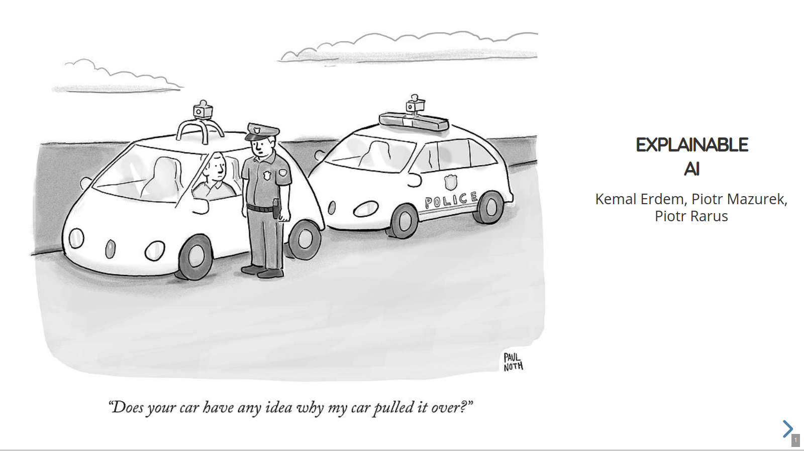

# XAI-Presentation
Presentation on Explainable AI methods conducted at Wrocław University of Science and Technology on 14 Jan. 2021

Presentation avalible at: [tugot17.github.io/xai-presentation](https://tugot17.github.io/XAI-Presentation/#/)

## Content

- Approaches to XAI: [Slide 3](https://tugot17.github.io/XAI-Presentation/#/2)
- Avalible XAI tools: [Slide 24](https://tugot17.github.io/XAI-Presentation/#/23)
- XAI challenges and problems: [Slide 44](https://tugot17.github.io/XAI-Presentation/#/43)

## Authors

- [Kemal Erdem](https://github.com/burnpiro)
- [Piotr Mazurek](https://github.com/tugot17)
- [Piotr Rarus](https://github.com/piotr-rarus)
